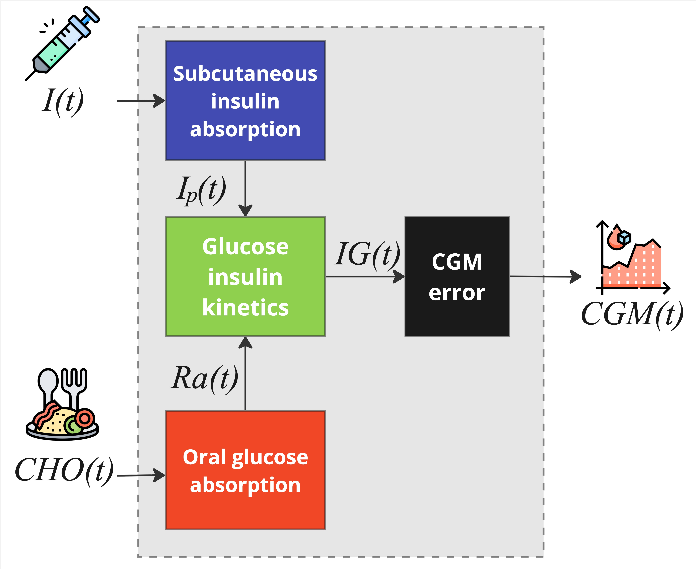

# Choosing Blueprint

Choosing the right `blueprint` for the digital twin is one of the key choices 
to be made when using ReplayBG. This must be done when a `ReplayBG` object needs to 
be created.

As a matter of fact, the blueprint, which is associated to a specific mathematical
model, will practically represent the resulting digital twin and will define its 
domain of applicability as well as what are its final "capabilities".

So, what are the possibilities? And, most importantly, how to decide?

There are two possibilities: 
* `blueprint='single-meal'`: by "single meal" one can refer to a specific period 
of time when a specific subject had only 1 main meal and a corresponding insulin 
basal-bolus administration. Usually, this period of time spans maximum 6/8 hours,
starts near such main meal, and ends just before the subsequent main meal and/or after
a reasonable amount of time.
* `blueprint='multi-meal'`: by "multi meal" one can refer to a specific period 
of time when a specific subject had more than 1 main meal and a
corresponding insulin basal-bolus administration regimen. One can think to such 
period of time by thinking to a day, when multiple meals occur, or even multiple days.

As such, the driver through the choice of the right blueprint are the **data** to
be used to create the digital twin. Anyway, ReplayBG will not choose automatically the 
right blueprint based on the input data, so this aspect is up to the user.

In the following, details on the two blueprint structures are reported, as well as their 
key capabilities and constraints.

::: tip
Generally, the multi meal blueprint is the most common choice since usually one deals with
data that include more than 1 meal and more than 6/8 hours.
:::

## Single-meal

### Usage

To use the single-meal blueprint, set the `blueprint` parameter to `single-meal` when building the `ReplayBG` object: 

```python
rbg = ReplayBG(blueprint='single-meal', ...)
```

More details can be found in [The ReplayBG Object](./replaybg_object.md) page. 

### Structure
The single-meal blueprint is composed of four main subsystems: subcutaneous insulin absorption, oral
glucose absorption, glucose-insulin kinetics, CGM sensor error.  



#### Subcutaneous Insulin Absorption Subsystem
The subsystem of subcutaneous insulin absorption system is composed of three compartments and describes the 
absorption dynamics of exogenous insulin infusion to the plasma. Exogenous insulin $I(t)$ is infused to the 
first compartment, which represents insulin in a non-monomeric state. Then, "non-monomeric" insulin diffuses 
to the second compartment, representing insulin in a monomeric state, and eventually reaches plasma. 
Model equations are:

$
\begin{cases}
   \dot{I}_{sc1}(t) = -  k_d \cdot I_{sc1}(t)  + I(t-\gamma)/V_I \\
   \dot{I}_{sc2}(t) = k_{d} \cdot I_{sc1}(t) - k_{a2} \cdot I_{sc2}(t) \\
   \dot{I}_{p}(t) = k_{a2}\cdot I_{sc2} - k_e \cdot I_p(t)
\end{cases}
$

where $I_{sc1}$ (mU/kg) and $I_{sc2}$ (mU/kg) represent the insulin in a non-monomeric and monomeric state, 
respectively; $I_p$ (mU/l) is the plasma insulin concentration;
$k_d$ (min$^{-1}$) is the rate constant of diffusion from the first to the second compartment;  $k_{a2}$ (min$^{-1}$) 
is  the rate constant of subcutaneous insulin absorption from the second compartment to the plasma; $k_e$ (min$^{-1}$) 
is the fractional clearance rate set to 0.127 min$^{-1}$; $V_I$ (l/kg) is the volume of insulin distribution set 
to 0.126 l/kg; $\gamma$ (min) is the delay in the appearance of insulin in the first compartment, set to 8 min.  

#### Oral Glucose Absorption Subsystem
The subsystem of oral glucose absorption system describes the gastro-intestinal tract as a three-compartment system: 
the first two compartments quantify the glucose in the stomach, while the third compartment models the upper small 
intestine where CHO is absorbed. 
Model equations are: 

$
\begin{cases}
   \dot{Q}_{sto1}(t) = - k_{empt}\cdot Q_{sto1}(t)  + CHO(t-\beta) \\
   \dot{Q}_{sto2}(t) = k_{empt}\cdot Q_{sto1}(t) - k_{empt}\cdot Q_{sto2}(t)\\
   \dot{Q}_{gut}(t) = k_{empt}\cdot Q_{sto2}(t) - k_{abs}\cdot Q_{gut}(t)
\end{cases}
$

where $Q_{sto1}$ (mg / kg) and $Q_{sto2}$ (mg / kg) are the amounts of glucose in the stomach in solid and liquid 
state, respectively; $Q_{gut}$ (mg/kg) is the glucose concentration in the intestine; $k_{empt}$ (min$^{-1}$) 
is the rate constant of gastric emptying; $k_{abs}$ (min$^{-1}$) is the rate constant of intestinal absorption; 
$CHO$ (mg/kg/min) is the ingested carbohydrate rate; $\beta$ (min) is the meal absorption delay. 
The model allows to estimate the rate of glucose appearance in plasma $Ra$ (mg/kg/min) as:

$
Ra(t) = f\cdot k_{abs} \cdot Q_{gut}(t)
$

where $f$ (dimensionless) is the fraction of the intestinal content absorbed in the plasma set to 0.9.

#### Glucose-Insulin Kinetics Subsystem
The subsystem is composed of three compartments, the first describing the effect of insulin action and oral
glucose rate of appearance on plasma glucose concentration, the second quantifies the impact of plasma insulin 
concentration on insulin action, and the last one represents the transport of glucose from plasma to the interstitium. 
Model equations are:

$
\begin{cases}
   \dot{G}(t) = - [SG + \rho(G) X(t)] \cdot G(t) + SG \cdot G_b + Ra(t) / V_G \\
   \dot{X}(t) = - p_2 \cdot [X(t) - SI\cdot(I_p(t)-I_{pb})] \\
   \dot{IG}(t) = - \frac{1}{\alpha}(IG(t) - G(t))
\end{cases}
$

where $G$ (mg/dl) is the plasma glucose concentration, $X$ (min$^{-1}$) is the insulin action on glucose disposal 
and production; $IG$ (mg/dl) is the interstitial glucose concentration; $SG$ (min$^{-1}$) is the glucose effectiveness 
that describes the glucose ability to promote glucose disposal and inhibit glucose production; $G_b$ (mg/dl) is the 
basal glucose concentration in the plasma; $V_G$ (dl/kg) is the volume of glucose distribution set to 1.45 dl/kg; $p_2$ (min$^{-1}$) 
is the rate constant of insulin action dynamics; $SI$ (ml/$\mu$U$\cdot$min) is the insulin sensitivity; $I_{pb}$ (mU/l)
is the basal insulin concentration in the plasma; $\alpha$ (min) is the delay between plasmatic and IG compartments set to 7 min; 
and $\rho(G)$, is a deterministic function that allows to better represent glucose dynamics in the hypoglycemic range 
by increasing insulin action when glucose decreases below a certain threshold:

$
    \rho(G)  =  
    \begin{cases}
        1 \hspace{5.04cm}\quad \text{if }  G \geq G_b \\
        1 \!+\! 10 r_1 \{ [ln(G)]^{r_2} - [ln(G_b)]^{r_2} \}^2  \\
        \hspace{4.24cm}\quad \text{if } G_{th}< G < G_b \\
        1 \!+\! 10 r_1 \{ [ln(G_{th})]^{r_2} - [ln(G_b)]^{r_2} \}^2 \quad \text{if } G \leq G_{th}
    \end{cases}
$

where $G_{th}$ is the hypoglycemic threshold (set to 60 mg/dl) and $r_1$ (dimensionless) and $r_2$ (dimensionless) 
are two model parameters, without direct physiological interpretation, set to 1.44 and 0.81, respectively.

#### CGM sensor error model
The subsystem describes the CGM sensor error model. For more details on the CGM error model, please refer to the
[CGM Error Model](./cgm_model.md) page.

#### Overall model

The resulting model of T1D glucoregulatory system described above, can be rewritten as: 

$
    \begin{cases}
        \dot{\pmb{x}}_{phy} (t)= \textbf{\textit{f}}_{phy}(\pmb{x}_{phy}, \pmb{u}_{phy}, t, \boldsymbol{\theta}_{phy}) \\
        y(t) = CGM(t)
    \end{cases}
$

where  $\pmb{x}_{phy}(t)$ and $\pmb{u}_{phy}(t)$ are the state and the input vectors, $\textbf{\textit{f}}_{phy}(\cdot)$
is the state update function; $\boldsymbol{\theta}_{phy}$ is the set of unknown model parameters to be estimated by the 
twinning procedure to create the DT-T1D:

$\boldsymbol{\theta}_{phy} = [k_{empt}, k_{abs}, \beta, k_{a2}, k_{d}, G_b, S_G, SI]^T$

### What can I do?

Using the single-meal blueprint you can create digital twin using portion of data that contains **just one main meal**,
e.g., a breakfast, a lunch, a dinner, or a snack, and spans no more than 8 hours. 

This is because its equations can just represent one single meal absorption (i.e., via $k_{empt}, k_{abs}, \beta$) and
a single value of insulin sensitivity, which is known to vary throughout the day.

Furthermore, since the equations start for steady-state conditions additional data requirements must be taken into account.
Particularly, user must be careful in selecting a data starting point that is sufficiently far, e.g., 4 hours, 
from the last recorded insulin/meal input, thus guaranteeing with a certain degree of confidence that 
"data are starting from steady-state" as well.

More details and guidance on such requirements, as well as on the format of input data, please refer to the 
[Data Requirements](./data_requirements.md) page. 

## Multi-meal

### Usage

To use the multi-meal blueprint, set the `blueprint` parameter to `multi-meal` when building the `ReplayBG` object: 

```python
rbg = ReplayBG(blueprint='multi-meal', ...)
```

More details can be found in [The ReplayBG object](./replaybg_object.md) page. 

### Structure
The multi-meal blueprint is an expanded version of the single-meal one. It is composed of four main subsystems: 
subcutaneous insulin absorption, oral glucose absorption, glucose-insulin kinetics, CGM sensor error.  


#### Subcutaneous Insulin Absorption Subsystem
The subsystem of subcutaneous insulin absorption coincides with the one of the single-meal blueprint. It is composed of 
three compartments and describes the absorption dynamics of exogenous insulin infusion to the plasma. 
Exogenous insulin $I(t)$ is infused to the first compartment, which represents insulin in a non-monomeric state.
Then, "non-monomeric" insulin diffuses to the second compartment, representing insulin in a monomeric state, 
and eventually reaches plasma. 
Model equations are:

$
\begin{cases}
   \dot{I}_{sc1}(t) = -  k_d \cdot I_{sc1}(t)  + I(t-\gamma)/V_I \\
   \dot{I}_{sc2}(t) = k_{d} \cdot I_{sc1}(t) - k_{a2} \cdot I_{sc2}(t) \\
   \dot{I}_{p}(t) = k_{a2}\cdot I_{sc2} - k_e \cdot I_p(t)
\end{cases}
$

where $I_{sc1}$ (mU/kg) and $I_{sc2}$ (mU/kg) represent the insulin in a non-monomeric and monomeric state, 
respectively; $I_p$ (mU/l) is the plasma insulin concentration;
$k_d$ (min$^{-1}$) is the rate constant of diffusion from the first to the second compartment;  $k_{a2}$ (min$^{-1}$) 
is  the rate constant of subcutaneous insulin absorption from the second compartment to the plasma; $k_e$ (min$^{-1}$) 
is the fractional clearance rate set to 0.127 min$^{-1}$; $V_I$ (l/kg) is the volume of insulin distribution set 
to 0.126 l/kg; $\gamma$ (min) is the delay in the appearance of insulin in the first compartment, set to 8 min.  

#### Oral Glucose Absorption Subsystem
The subsystem of the oral glucose absorption of the single-meal blueprint, provides an accurate description of oral 
glucose absorption rate and dynamics for a single meal intake, but it is not suitable when multiple different meals 
are present. 
For this reason, it has been replaced with a "multi-stomach" system, where each "stomach" is dedicated to describe 
one of the specific meal absorption dynamics that can be observed through a single-day:

$
\begin{cases}
   \dot{Q}_{{sto1}_M}(t) = - k_{empt}\cdot Q_{{sto1}_M}(t)  + CHO_M(t-\beta_M) \\
   \dot{Q}_{{sto2}_M}(t) = k_{empt}\cdot Q_{{sto1}_M}(t) - k_{empt}\cdot Q_{{sto2}_M}(t)\\
   \dot{Q}_{{gut}_M}(t) = k_{empt}\cdot Q_{{sto2}_M}(t) - k_{{abs}_M}\cdot Q_{{gut}_M}(t)
\end{cases}
$

$
Ra(t) = f\cdot \sum_{M}k_{{abs}_M} \cdot Q_{{gut}_M}(t) 
$

where suffix $M \in \{B, L, D, S, H\}$ denotes the type of meal (i.e., $B$: breakfast, $L$: lunch, $D$: dinner, $S$: 
snack, $H$: hypotreatment); $CHO_M(t)$ (mg/kg/min) is the input of the subsystem and represents the rate of 
carbohydrates intake of meal $M$; $Q_{sto1_M}$ and $Q_{sto2_M}$ (mg/kg), represent the concentration of glucose in 
the stomach in solid and liquid state, respectively; $Q_{gut_M}$ (mg/kg) is the concentration of glucose in the 
intestine; and $Ra$ (mg/kg/min) is the rate of glucose appearance in plasma.
Model parameters $k_{empt}$ (min$^{-1}$) and $k_{abs_M}$ (min$^{-1}$) are the gastric emptying rate and the intestinal
absorption rate of meal $M$, respectively; $f$ (unitless) is the fraction of intestinal content absorbed in plasma set to 0.9; 
and $\beta_M$ (min) is the delay in the appearance of the meal $M$ in the stomach with $\beta_H$ set to 0.  

It is important to note that, since multiple snacks and/or hypoglycemia treatments can occur in a single day,
single absorption rate constants, $k_{abs_S}$ and $k_{abs_H}$, and delays, $\beta_S$ and $\beta_H$, 
have been assumed for snacks and hypotreatments, respectively. 

#### Glucose-Insulin Kinetics Subsystem
The subsystem is composed of three compartments, the first describing the effect of insulin action and oral
glucose rate of appearance on plasma glucose concentration, the second quantifies the impact of plasma insulin 
concentration on insulin action, and the last one represents the transport of glucose from plasma to the interstitium. 
Model equations are:

$
\begin{cases}
   \dot{G}(t) = - [SG + \rho(G) X(t)] \cdot G(t) + SG \cdot G_b + Ra(t) / V_G \\
   \dot{X}(t) = - p_2 \cdot [X(t) - SI(t)\cdot(I_p(t)-I_{pb})] \\
   \dot{IG}(t) = - \frac{1}{\alpha}(IG(t) - G(t))
\end{cases}
$

where $G$ (mg/dl) is the plasma glucose concentration, $X$ (min$^{-1}$) is the insulin action on glucose disposal 
and production; $IG$ (mg/dl) is the interstitial glucose concentration; $SG$ (min$^{-1}$) is the glucose effectiveness 
that describes the glucose ability to promote glucose disposal and inhibit glucose production; $G_b$ (mg/dl) is the 
basal glucose concentration in the plasma; $V_G$ (dl/kg) is the volume of glucose distribution set to 1.45 dl/kg; $p_2$ (min$^{-1}$) 
is the rate constant of insulin action dynamics; $SI$ (ml/$\mu$U$\cdot$min) is the time-variant insulin sensitivity (to
account for patient-specific intraday insulin sensitivity variability):

$
SI(t) =  \begin{cases}
       SI_B \quad \text{if } 4 \text{ AM } \leq t < 11 \text{ AM } \\
       SI_L \quad \text{if } 11 \text{ AM } \leq t < 5 \text{ PM } \\
       SI_D \quad \text{if } t < 4 \text{ AM } \text{ OR } t \geq 5 \text{ PM } \\
    \end{cases}
$

$I_{pb}$ (mU/l) is the basal insulin concentration in the plasma; $\alpha$ (min) is the delay between plasmatic 
and IG compartments; and $\rho(G)$, is a deterministic function that allows to better represent glucose 
dynamics in the hypoglycemic range by increasing insulin action when glucose decreases below a certain threshold:

$
\rho(G) = \begin{cases}
        1 \hspace{5.04cm}\quad \text{if }  G \geq G_b \\
        1 \!+\! 10 r_1 \{ [ln(G)]^{r_2} - [ln(G_b)]^{r_2} \}^2  \\
        \hspace{4.24cm}\quad \text{if } G_{th}< G < G_b \\
        1 \!+\! 10 r_1 \{ [ln(G_{th})]^{r_2} - [ln(G_b)]^{r_2} \}^2 \quad \text{if } G \leq G_{th}
    \end{cases}
$

where $G_{th}$ is the hypoglycemic threshold (set to 60 mg/dl) and $r_1$ (dimensionless) and $r_2$ (dimensionless) 
are two model parameters, without direct physiological interpretation, set to 1.44 and 0.81, respectively.

#### CGM sensor error
The subsystem describes the CGM sensor error model. For more details on the CGM error model, please refer to the
[CGM Error Model](./cgm_model.md) page.

#### Overall model

The resulting model of T1D glucoregulatory system described above, can be rewritten as: 

$
    \begin{cases}
        \dot{\pmb{x}}_{phy} (t)= \textbf{\textit{f}}_{phy}(\pmb{x}_{phy}, \pmb{u}_{phy}, t, \boldsymbol{\theta}_{phy}) \\
        y(t) = CGM(t)
    \end{cases}
$

where  $\pmb{x}_{phy}(t)$ and $\pmb{u}_{phy}(t)$ are the state and the input vectors, $\textbf{\textit{f}}_{phy}(\cdot)$
is the state update function; $\boldsymbol{\theta}_{phy}$ is the set of unknown model parameters to be estimated by the 
twinning procedure to create the DT-T1D:

$\boldsymbol{\theta}_{phy} = [\{k_{empt_M}, k_{abs_M}, \beta_M\}_{M\in\{B, L, D, S, H\}}, k_{a2}, k_{d}, G_b, S_G, SI_B, SI_L, SI_D]^T$

### What can I do?

Using the multi-meal blueprint you can create digital twin using portion of data that span a single day.

This is because its equations can just represent the meal absorption of a set of meal intakes usually observed
throughout a single day, i.e, a breakfast, a lunch, and so on, via 
$\{k_{empt_M}, k_{abs_M}, \beta_M\}_{M\in\{B, L, D, S, H\}}$), and
a profile of insulin sensitivity that usually characterizes a single day as well.

Furthermore, since the equations start for steady-state conditions additional data requirements must be taken into account.
Particularly, user must be careful in selecting a data starting point that is sufficiently far, e.g., 4 hours, 
from the last recorded insulin/meal input, thus guaranteeing with a certain degree of confidence that 
"data are starting from steady-state" as well.

More details and guidance on such requirements, as well as on the format of input data, please refer to the 
[Data Requirements](./data_requirements.md) page. 

So, what if you want to use portions of data that span more than one day? The solution is to create multiple digital
twins, each representing a single day, and then "glue" them together.

Practically, this translates in the following steps: 

1. splitting the data into single days
2. creating the digital twin corresponding to the first day by starting from steady state conditions
3. creating the digital twins of the second day using the same twinning procedure but setting the initial model conditions
to the final model conditions of the first day.
4. iterating, for each subsequent day of the interval, step 3.

This process eliminates the need for the initial steady-state assumption for all days except the first, 
enabling the twinning and simulation of longer, more comprehensive data intervals.

More details and guidance on how to create digital twins using just a single day or more than one, please refer to the 
[Twinning Procedure](./twinning_procedure.md) page.

